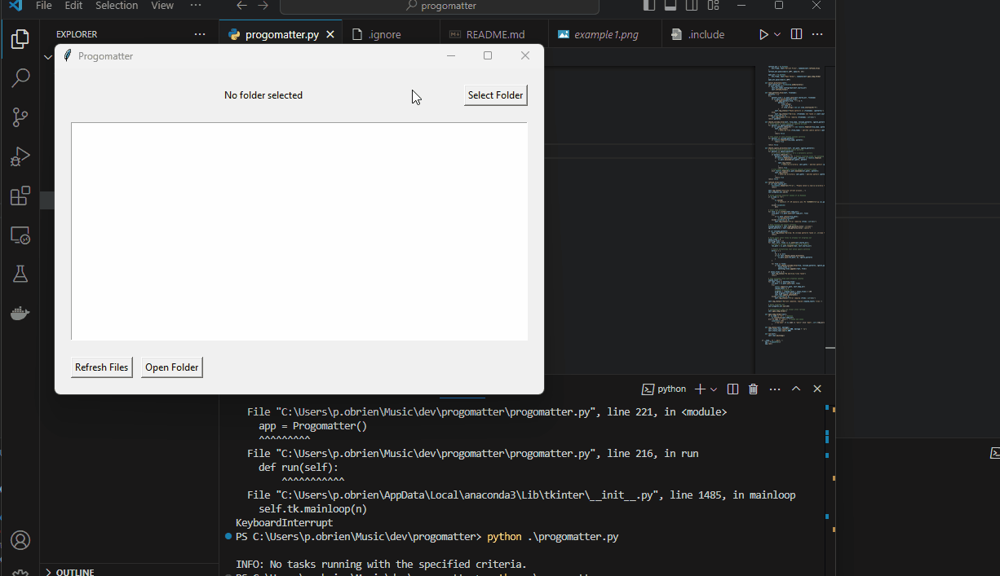

# progomatter

This app is for accelerating prototyping development with AI. It allows anyone to quickly create app prototypes using their preferred LLM API.

## Usage

- Create a `.ignore` and `.include` file in the root directory of your project. Progomatter will extract all files from the folder matching the file names or types in the `.include` file. Files and folders in the `.ignore` will be ignored, following the same syntax as `.gitignore.`.
- Run the GUI, navigate your project folder, and extract the files. Progomatter will recursively extract all files in the folder and place them in a single temporary folder.
- Drag the contents into the LLM chat window. (For example, Claude projects).
- Refresh to view new files with the refresh button. It will perform a copy operation and display the new files.

## TODO

[ ] Add ability to delete files that already exist, retrieve the new version with the claude API, and replace the older version of the file with the new version.
[ ] Add git-like functionality for changes
[ ] Add "commits" dependent to each feature session. You can look back and see the changes over time in a simplified way, similar to git.
[ ] Add project files collapsible tree with line counts and changes.
[ ] Add "generated changes" box with accept commit and decline commit.
[ ] Add automatic check if there is a significant line count reduction.
[ ] Add a counter for line number changes
[ ] Add feature session tracking, you can keep working changes in folders that show up as "features" in the GUI.
[ ] Low token usage optimization. Rebuild with the new version after each accepted "commit", forcing a full readthrough for each question.
[ ] More
