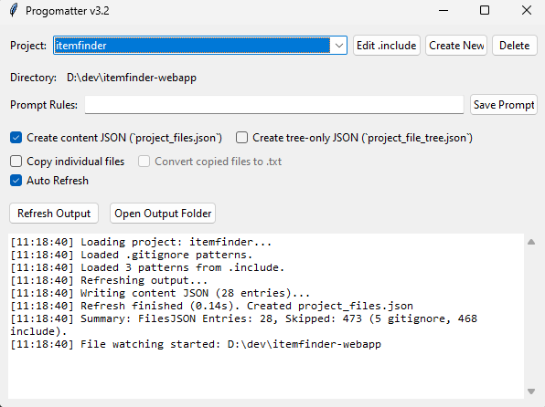

# progomatter



This app is for accelerating prototyping development with AI. It allows anyone to quickly copy and format all the project files from a program that contains nested folders. It also allows you to convert the filetypes to a generic .txt file for use with LLMs that do not support less common filetypes, for example Gemini not accepting .js or .svelte files even though they are plain text. It can also combine all your files into one megafile complete with filename titles to make it easier to copy and paste, and delete in things like Claude projects.

## Usage

First
**Run:** ```pip install -r requirements.txt``` in the project folder.

- Clone the program and run progomatter.py after installing the packages in requirements.txt. `python .\progomatter.py`
- Progomatter will automatically create a `.include` file in your selected project folder. You can edit this in the interface. If `.include` contains text, it will only include the filetypes that you specify in the file (following the same formatting as a .gitignore file).
- Progomatter will exclude anything in the `.gitignore` file if present.
- Open project folders like you would in vscode
- You can pin the window on top of all the other windows and set your desired transparency.
- Auto refresh is enabled by default and will watch for changes in any of the files, automatically updating them in the temp folder if you save changes.
- You can create a `prompt.txt` file by filling in the prompt rules textbox. The LLM might listen to this, it might not... Sometimes it helps.
- Drag and drop from temp folder into your LLM chat, that's it.
